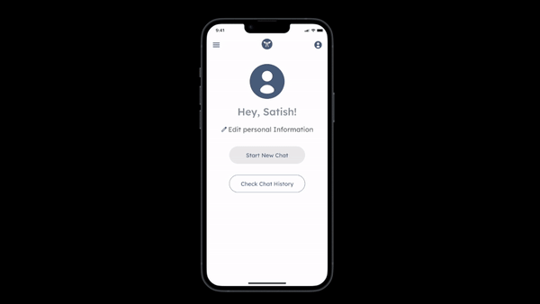

# Legal Buddy 

Legal Buddy is an AI-powered chatbot designed to summarize legal documents in regional languages, making complex legal information accessible to everyone.

---


## 📱 User Interface (UI)

The UI is clean, minimalistic, and user-friendly. Here's what it includes:

- **Home Screen**: Access recent chats and start new conversations.
- **Document Input**: Upload legal documents or capture photos for AI analysis.
- **Chat Screen**: View document summaries in your preferred language.

### Color Palette & Typography:


---

## 🧠 AI Architecture

Legal Buddy uses:

- **OCR Technology**: To extract text from uploaded documents or images.
- **AI Language Model**: To summarize legal documents with regional language support.
- **Translation API**: Ensures accurate and context-sensitive translations.

### Architecture Diagram:


---

## 🔧 Integration and Installation

### Prerequisites:
- Node.js (v16 or higher)
- npm or yarn
- A configured API key for the AI service (e.g., OpenAI API)

### Installation Steps:
<div align="center">
  
</div>
1. Clone the repository:
   ```bash
   git clone https://github.com/yourusername/legal-buddy.git
   ```
2. Navigate to the project directory:
   ```bash
   cd legal-buddy
   ```
3. Install dependencies:
   ```bash
   npm install
   ```
4. Start the application:
   ```bash
   npm start
   ```

You're all set to use Legal Buddy! 🎉
